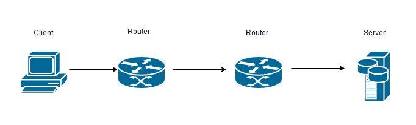

#What is this?#

Answers to assignments for week 50 in system design at EAL.

## 8.15 ##

TCP uses three or four way handshakes. Shown in illustration 1 is the
communication diagram of this handshake. Illustration 2 shows the
sequence diagram of establishing a TCP connection.

*Illustration 1: Initial TCP handshake communication diagram*

*Illustration 2: Initial TCP handshake sequence diagram*

## 8.16 ##

The following diagrams shows a user on a workstation (Work01), logging
in to a system authenticating with the database server (SrvDB01) which
proceeds to ask an e-mail (exchange) server (SrvExch01), this server
stores the e-mail data on the database server (SrvDB01). Illustration 1
shows this as a communication diagram and Illustration 2 shows the
sequence diagram.

*Illustration 1: Initial TCP handshake communication diagram*

*Illustration 1: Initial TCP handshake sequence diagram*

## 8.17 ##

Illustration 1 shows a communication diagram and Illustration 2 shows
the sequence diagram of a pin request

*Illustration 1: Pinging google.com*

